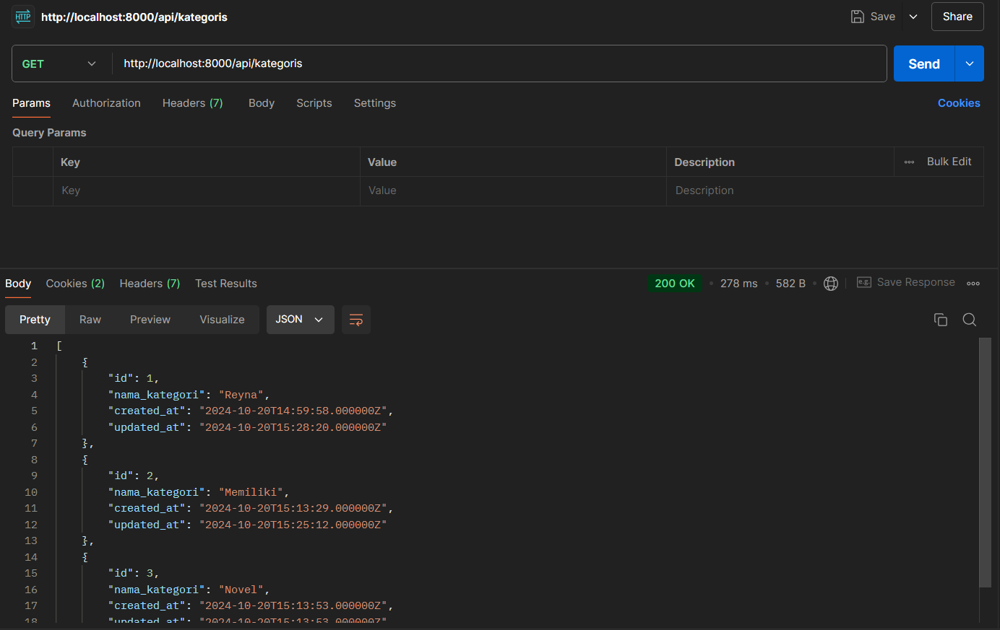

# Table Kategori

## Method Post

### Data tidak bisa ditambahkan karena pengaturan validasi

## Method Get

### Get dari Postman

### Get dari Chrome (Browser)

## Method Update

### Hasil ketika data sudah diperbarui

## Method Delete

### Sebelum ada data yang dihapus

### Setelah ada data yang dihapus

